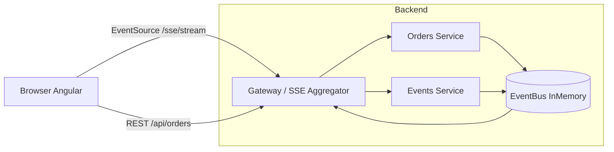
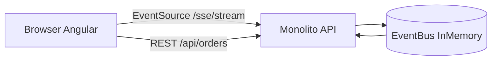

# Diagrama de Alto Nível (Serviços + Fluxo)

Representação textual (mermaid) e descrição da interação entre componentes planejados.

## 1. Mermaid (Visão Microserviços Futuro - F2)

## 2. Versão Simplificada (F1 Monolito)

## 3. Fluxo de Criação de Pedido
1. `POST /api/orders` chega ao Gateway (ou Monolito F1)
2. Validação + persistência InMemory
3. Publica evento `OrderCreated` no EventBus
4. Gateway/Aggregator assina e converte em SSE `event: order-created`
5. Browser recebe e atualiza UI

## 4. Fluxo de Mudança de Status (Job Simulado)
1. Job altera status para `PAID`
2. Publica `OrderStatusChanged`
3. SSE broadcast
4. Repetido para `FULFILLED`

## 5. Componentes e Responsabilidades
- Browser Angular: UI, consumo de SSE, criação de pedidos
- Gateway / SSE Aggregator: expõe `/sse/stream`, roteia REST, assina EventBus
- Orders Service: regras de negócio de pedidos
- Events Service (potencial): abstrações de broadcast e métricas
- EventBus (InMemory): pub/sub simples entre serviços internos

## 6. Conectividade SSE
- Única conexão por aba/navegador
- EventSource duradouro
- Heartbeat a cada 15s (`: ping`)

## 7. Escalabilidade (Evolução)
- Substituir InMemory por Redis Pub/Sub sem alterar consumidores
- Replicar Orders Service horizontalmente
- Replicar Gateway (balanceador precisa suportar conexões persistentes)

## 8. Segurança (Futuro)
- Token JWT anexado na query string ou header (SSE aceita headers custom via fetch polyfill ou fallback) – não implementado no MVP

## 9. Observabilidade
- Logs estruturados por evento
- Contador de conexões no Aggregator

---
Este documento satisfaz a Task 1.3.
